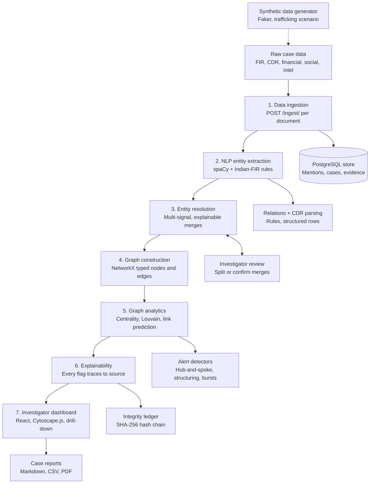

# Architecture — SUTRA (SIH26189)

## 7-stage pipeline

1. **Data ingestion layer** — multi-source adapters (FIR text, CDR, financial, social, intel)
2. **NLP entity extraction** — people, phones, locations, orgs, vehicles
3. **Entity resolution** — merge aliases, scripts, partial matches (hardest problem)
4. **Graph construction** — NetworkX, typed nodes and edges
5. **Graph analytics** — centrality, community detection, anomaly detection
6. **Explainability layer** — every flag traces to source evidence
7. **Investigator dashboard** — interactive graph UI with drill-down

Cross-cutting: synthetic data generator (feeds stage 1), ethics guardrails
(feeds stage 5).

## Pipeline flow

How data moves through the seven stages. The side components support a stage
but are not extra stages.

| # | Stage | What happens | Main code |
|---|---|---|---|
| 1 | Data ingestion | Each document is posted into a case; mentions and evidence links are persisted. | `api/routes/ingestion.py`, `db/repository.py` |
| 2 | NLP entity extraction | spaCy plus the Indian-FIR rule layer extract entities; relations come from deterministic rules; CDR and financial rows are parsed directly into entities and edges. | `nlp/pipeline.py`, `nlp/extraction.py`, `nlp/indian_rules.py`, `nlp/gazetteer.py`, `nlp/translit.py`, `nlp/relation_rules.py`, `nlp/structured.py` |
| 3 | Entity resolution | Runs at query time over all persisted mentions in a case (see [How entity resolution decides](#how-entity-resolution-decides)). | `api/casegraph.py`, `nlp/resolution.py`, `nlp/confidence.py` |
| 4 | Graph construction | Resolved entities become typed NetworkX nodes and edges. | `graph/build.py` |
| 5 | Graph analytics | Centrality, Louvain communities, anomaly detection, link prediction. | `graph/analytics.py`, `api/routes/alerts.py` |
| 6 | Explainability | Every flag links to its source documents; evidence-linking events are appended to the hash-chained ledger. | `graph/explainability.py`, `db.models.EvidenceLinkORM`, `ledger/chain.py` |
| 7 | Investigator dashboard | Interactive graph, evidence panel, ingestion form, alerts feed, reports. | `dashboard/`, `api/report_builder.py` |

The ledger records case creation, evidence-linking events and access-request
resolutions as a parallel audit trail; it is not the primary store for that
data.

## Scope boundary

This is **network analysis of known/already-open cases**, not predictive
policing. The system flags network *positions* (high centrality, bridging
roles) within an already-opened investigation's known entity set — it does
not score individuals outside an active case. Every flag traces back to
source evidence; the investigator makes the final call, not the algorithm.

## Entity schema

- **Person** — central entity, links to Phone (calls), Location (present-at),
  Vehicle (owns)
- **Event** — timestamped call/meeting/transaction connecting multiple
  entities in time; links to Organization (associated-with)
- All entities and events trace back to raw source records (FIRs, CDRs,
  financial records, surveillance, social media, criminal history, intel
  reports) — this traceability is what makes explainability (stage 6)
  possible.

## Roles & permissions

The system's `User` entity (who logs into the software — investigators,
analysts, admins) is kept architecturally and physically separate from the
`Person` entity in the criminal-network graph (who's a suspect in a case).
Conflating the two would be both a data-integrity bug and a serious privacy
problem: user auth data must never leak into, or be queryable alongside,
case entity data.

Four roles (`schema/user.py`), enforced both in the UI (route-level gating)
and — authoritatively — in the API (`api/auth.require_role` /
`api/permissions.py`):

| Role             | Scope                                                                        |
| ---------------- | ------------------------------------------------------------------------------ |
| **Investigator** | View + edit own assigned cases; full dashboard access for those cases          |
| **Analyst**      | Cross-case, read-only view scoped to their own agency; no edit rights          |
| **Admin**        | Manage user accounts, resolve access requests, view audit log — own agency     |
| **Super Admin**  | Everything Admin can do, across every agency                                  |

See the README's [Roles & permissions](../README.md#roles--permissions) and
[API surface](../README.md#api-surface) sections for the enforcement points.

## Tech stack

Full per-layer detail lives in the README's
[Tech stack](../README.md#tech-stack) table — kept in one place so this
doesn't drift out of sync. Summary:

| Layer             | Stack                                                                                                                    |
| ----------------- | ------------------------------------------------------------------------------------------------------------------------- |
| NLP/ML            | spaCy (`en_core_web_sm`) + an Indian-FIR rule layer (`nlp/indian_rules.py`, `nlp/gazetteer.py`, `nlp/translit.py`); optional zero-shot relation layer (`requirements-ml.txt`). No IndicNER-class model adopted — no checkpoint with a verified license found (see `THIRD_PARTY_NOTICES.md`). |
| Entity resolution | Multi-signal scoring (name + alias + shared identifiers + context, combined by noisy-OR) with constraint-aware clustering, review flags and persisted investigator overrides — `nlp/resolution.py`; see `docs/EVALUATION.md` |
| Graph             | NetworkX (preferred — see `THIRD_PARTY_NOTICES.md` on Neo4j Community's GPLv3 conflict)                                  |
| Backend/API       | FastAPI, PostgreSQL (SQLite for tests), Alembic migrations                                                               |
| Frontend          | React + Vite, Cytoscape.js                                                                                               |

See `THIRD_PARTY_NOTICES.md` for the full dependency license audit.

## How entity resolution decides

Resolution runs at query time over every persisted mention in a case
(`api/casegraph.py` → `nlp/resolution.py`), so it always sees the full
cross-document picture and ingestion stays append-only.

1. **Evidence per pair.** Name similarity (phonetic, token-aligned,
   script-independent: "Raju" = "राजू", "Mohd." = "Mohammad"), an explicit
   `alias`/`@`/`urf` in one document, a nickname declared as someone's alias
   in another, a phone/vehicle/account next to both names, shared locations.
   Independent evidence is combined with a noisy-OR (`nlp/confidence.py`).
2. **Vetoes.** Two full names that clearly differ (other first name or other
   surname) are never merged, however many phones they share — a family phone
   is not identity. Digits differ ("Sector 14" / "Sector 15") → never merged.
   Phone/vehicle/account numbers are exact-match only.
3. **Constraint-aware clustering.** Pairs are merged strongest-first, but two
   clusters only join if no cross pair is vetoed, so one ambiguous "Ramesh"
   cannot bridge "Ramesh Sharma" and "Ramesh Verma".
4. **Review, not silence.** ≥ 0.80 merges silently; 0.60–0.80 merges and is
   flagged `needsReview` with its reasons; below 0.60 does not merge.
   Investigators can split (`never_merge`) or confirm (`force_merge`) any
   pair; overrides persist per case and apply on every rebuild.
5. **Stable ids.** A resolved entity's id is a hash of its member mention
   ids, so the same evidence gives the same node id every time — which is
   what makes the persisted evidence trail and the ledger meaningful.

## Trafficking-specific structure (Women Safety Division)

`data/trafficking_scenario.py` plants the documented structure of a
trafficking network — recruitment funnel (hub-and-spoke calls into a handler
who uses a nickname and several SIMs), a transporter and vehicle, a safehouse
behind a front organisation, and commission payments kept just under a
reporting threshold — and writes the paper trail (FIRs incl. Hindi, a
surveillance report, an intelligence note, CDRs, financial records). The
pipeline must *discover* it: the handler resolves to one node, ranks as the
top influencer, and the hub-and-spoke, structuring and communication-burst
alerts fire (`tests/test_trafficking_end_to_end.py`). The alerts describe
network patterns in an open case; they do not score individuals.
